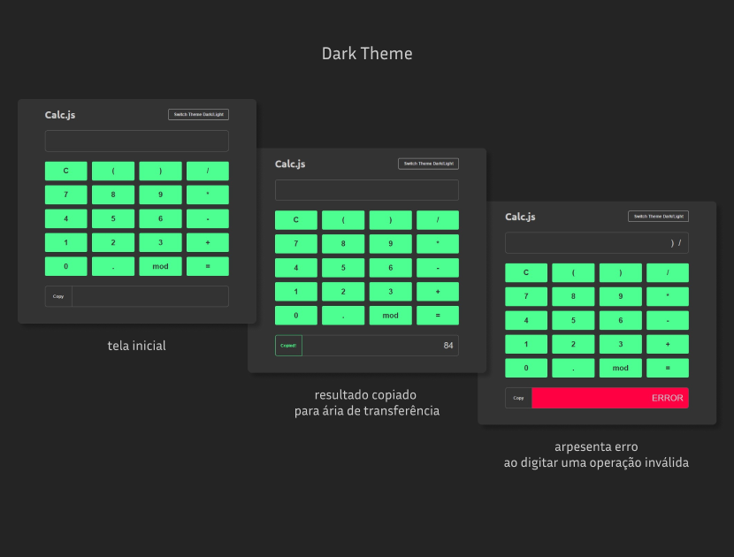
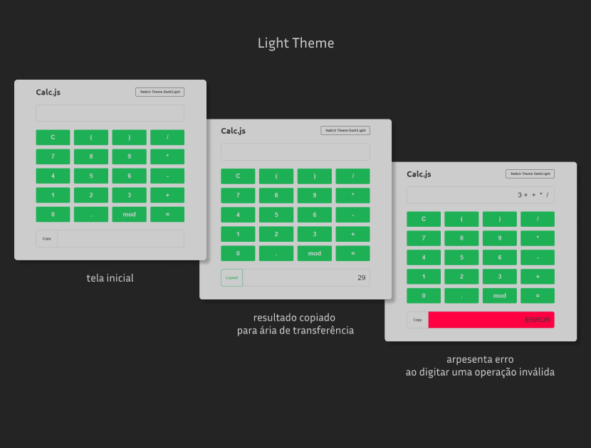

# Calc.Js
**Projeto desenvolvido no curso Programador Fullstack [OneBitCode.com](https://programador.onebitcode.com/)**

## Intro
O projeto é uma calculadora simples usando Javascript Vanilla.
O intuito do projeto é treinar as ferramentas abordadas durante as aulas.

## Stack do projeto
- HTML
- CSS
- Javascript
- Git
- Hospedagem no github pages.

## Prática
- Manipulação da DOM: visualização do resultado em tela;
- Manipulação de estilos: alternando temas;
- Lógica de programação para:
  - calcular as operações básicas: soma, subtração, multiplicação, divisão, módulo e operações com parênteses;
  - copiar resultado para área de transferência;
  - apresentar erro ao digitar uma operação inválida.

## ⚠️ Atenção  
Doi usado o recurso `eval()` para realizar os cálculos matemáticos. Porém, para ser replicado em outros projetos com conteúdo mais sensíveis, se faz necessária análise, pois esse recurso pode abrir uma "brecha" no código, já que é uma forma de processar javascript de dentro de um `input` por exemplo.
Nesse projeto o uso foi tranquilo pois reduzimos os caracteres a serem inseridos no input da calculadora à números e poucos caracteres: `+ - * / . ( ) %`

## Screenshots

  ### Dark Theme
  

  ### Light Theme
  

## Deploy GitHub Pages
Veja a aplicação online: [Calc.js](http://www.github.com)

## Ideias e implementações são bem-vindas!
Clone o repo ou use-o como template